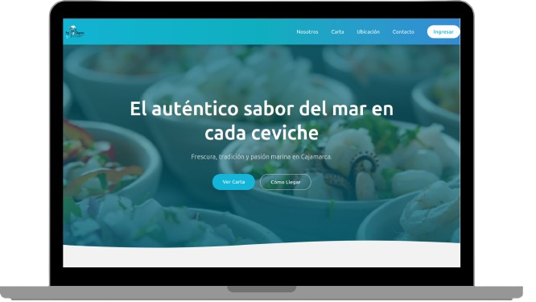
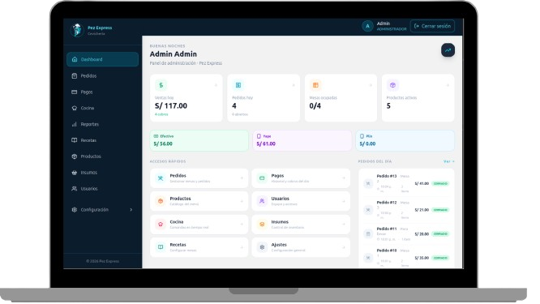
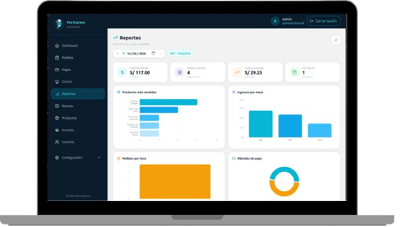
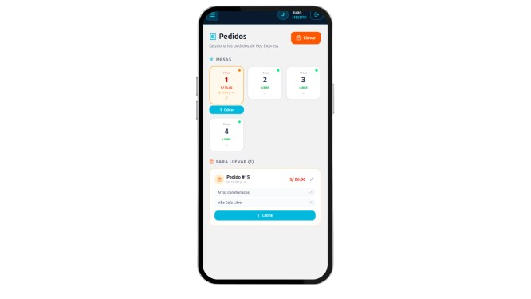

# 🐟 Pez Express — Sistema de Gestión de Restaurante

Sistema web completo para la gestión de pedidos, cocina, pagos e inventario del restaurante **Pez Express**.  
Diseñado para optimizar el flujo operativo entre meseros, cocina y administración en tiempo real.

---

## 🧱 Tecnologías

**Backend**
- Java 17 + Spring Boot
- Spring Security + JWT
- MySQL 8
- WebSockets (STOMP)
- Docker

**Frontend**
- React 18 + TypeScript
- Vite
- Tailwind CSS
- Axios
- Nginx (producción)

---

## 📦 Módulos del sistema

- 🔐 Autenticación con roles (Administrador / Mesero)
- 🪑 Gestión de mesas y pedidos
- 🍽️ Panel de cocina en tiempo real (WebSocket)
- 📦 Gestión de productos, insumos y recetas
- 💳 Registro de pagos
- ⚙️ Configuración del sistema
- 📊 Reportes y métricas

---

## 🚀 Cómo ejecutar el proyecto

### Requisitos previos
- Docker y Docker Compose instalados
- Git

### Pasos

**1. Clonar el repositorio**

```bash
git clone https://github.com/J05U307/pez_express.git
cd pez_express
```

**2. Crear el `.env` del backend**

```bash
cp .env.example .env
```

> Edita `.env` con tus valores reales (base de datos, puertos, JWT secret, etc.)

**3. Crear el `.env` del frontend**

```bash
cp pez_express_frontend/.env.example pez_express_frontend/.env
```

> Edita con tus credenciales de Cloudinary.

**4. Generar e insertar el usuario administrador**

Primero, genera el password encriptado ejecutando la clase:

```
pez_express_backend/src/main/java/.../TestPassword.java
```

Escribe la contraseña que deseas usar y copia el hash BCrypt que se genera en consola.

Luego, abre el archivo:

```
pez_express_backend/src/main/resources/data.sql
```

Y reemplaza el campo `password` con el hash generado:

```sql
.
.
.
VALUES (
    1, 'Admin', 'Admin', '00000000', '000000000',
    'admin',
    '$2a$10$TU_HASH_GENERADO_AQUI',
    'ACTIVO', 1, 1
);
```

**5. Levantar los servicios**

```bash
docker compose up --build
```

**6. Acceder al sistema**

```
http://localhost
```

### 🔑 Credenciales por defecto

| Usuario | Contraseña              | Rol           |
|---------|-------------------------|---------------|
| admin   | (la que configuraste)   | Administrador |

### 📸 Capturas del sistema


### Web Principal.


### Panel de administrador


## Panel de reportes


### Gestión de pedidos vista desde movil


---

## 👨‍💻 Autor

**Josue Cusquisiban**  
[GitHub](https://github.com/J05U307) · [LinkedIn](https://linkedin.com/in/josue-cusquisiban-95b299361)